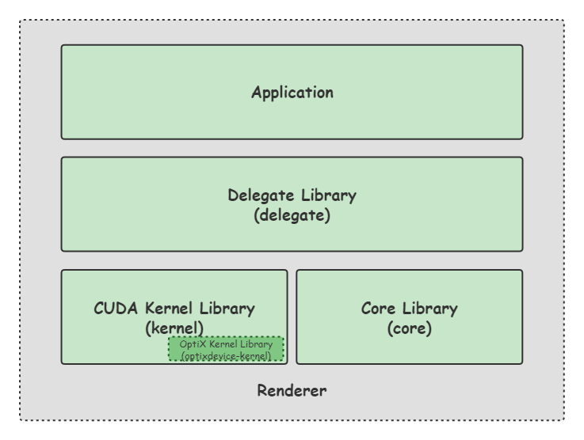

# Framework Diagram

Our renderer framework currently is very concise and clearly separated into three parts of libraries: application, delegate, cuda and optix kernels, and core library.

All rendering algorithms are implemented within the kernel library, except for the wavefront kernel integrators.

For example, all light evaluation and sampling methods reside in `libkernel\emitters\` (along with some mathematical and utility functions).
They also live in `kernel` namespace, well isolated from host side `core` namespace.
We use tagged union type `emitter` to abstract implementation details for different types of emitters.

Note that since we would like to ensure best performance in GPU, these device side data classes are specifically well-designed for high performance cuda kernels, which we will call as a "kernel type". 
All kernel type classes or structs are very lightweight and do not have sophisticated inheritance relationship or dynamic memory allocation.
They should be used as a value type and it should be always safe and efficient to use them in device side without worrying about object lifetime and storage.

However, kernel type is designed for kernel execution which may not be suitable for host side manipulation and that is the motivation for the "core type".
Almost all kernel types will have their equivalent core types (except for BSDFs, since it is always temporary allocated statically on-the-fly).
For example, `kernel::Emitter` corresponds to `core::Emitter` type and core Emitter has to deal with all the details such as scene graph editing, device memory allocation and compiling itself to its equivalent kernel type.

One key difference between base types for kernel and core libraries are core base types are used as a base class while kernel types are marked as `final` -- indicating it is never to be inherited from.

All core types reside in core library and all kernel type reside in kernel library but core library actaully relies on kernel library since it has to know the concrete type it needs to compile as.

There is also an OptiX part library called `optixdevice-kernel` to deal with ray scene traversal and hardware acceleration.
OptiX 7 is rewritten to be fully compatible with CUDA, but it it still closed source and needs to be specially handled and we use Ingo Wald's `owl` library to minimize efforts in setting up OptiX context and interop with its APIs.
We only use a small part of OptiX library indeed for ray intersection, fancy features such as direct callables are not needed.

Finally, we have a delegate library interacts with the core library.
Delegate library is used for disk I/O, image, mesh loading and denoising. Serialization and scene config files parsing could also be added to this library in the future.
Delegate library talks to the core library and transform some higher level resources (such as network in the future) to our core renderer library.

With these fundamental components, a sample renderer application could be built so we will have an application layer on the top.
GUI interaction, mouse inputs and display should be in this layer.
Note that postprocessing could also be in this layer using GLSL/HLSL.

# What TODO next?
Given this simple yet powerful framework, you could start with adding more new rendering features such as advanced BSDFs, opacity textures etc.

 - Polish scene import/export library support. Add GLTF, USD etc. support to the delegate library.
 - Build an interactive GUI with dear-imgui. You could bind to Scene APIs to achieve scene editing while rendering.
 - More advanced BSDFs and materials: Standard Principle BSDF.
 - Continue MDL support (see also `MDLCompiler`).
 - More unit tests.
 - Add a renderer SDK layer so that you could build a shared library.
 - More logging information (and write to disk files).
 - Profiling with NSight Compute to find out bottleneck (profiling is enabled with Debug build).
 - More fancy light transport methods.
 - More docs.
 - ...

# Where for References?
We are highly inspired by Mitsuba 0.6, PBRT-v4, LuxCoreRender and Cycles.